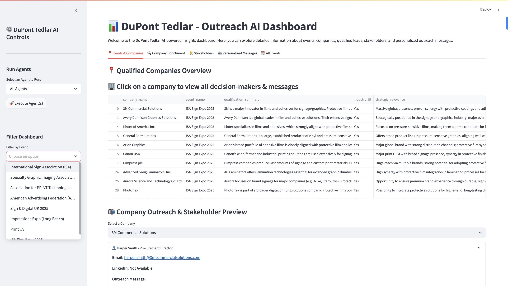
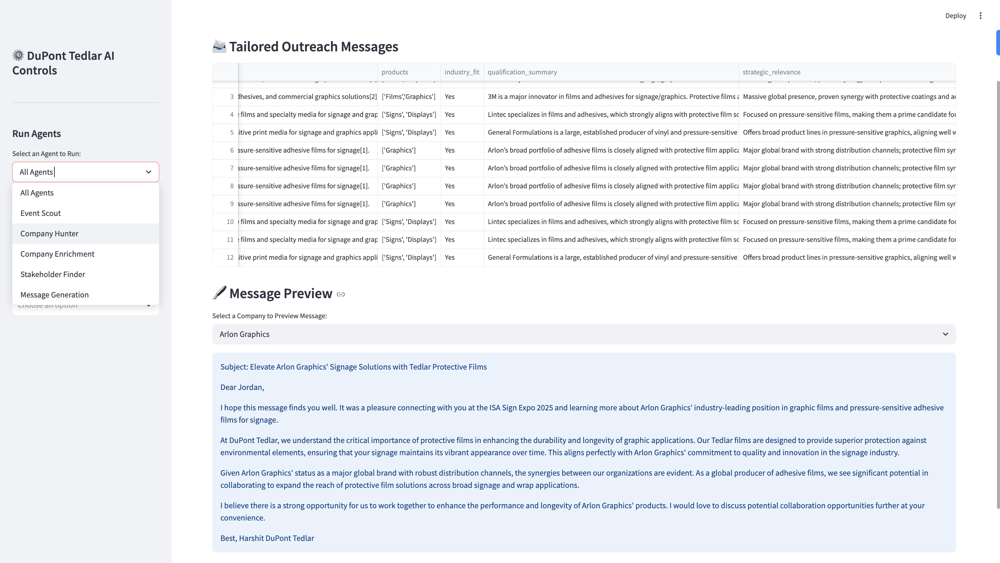
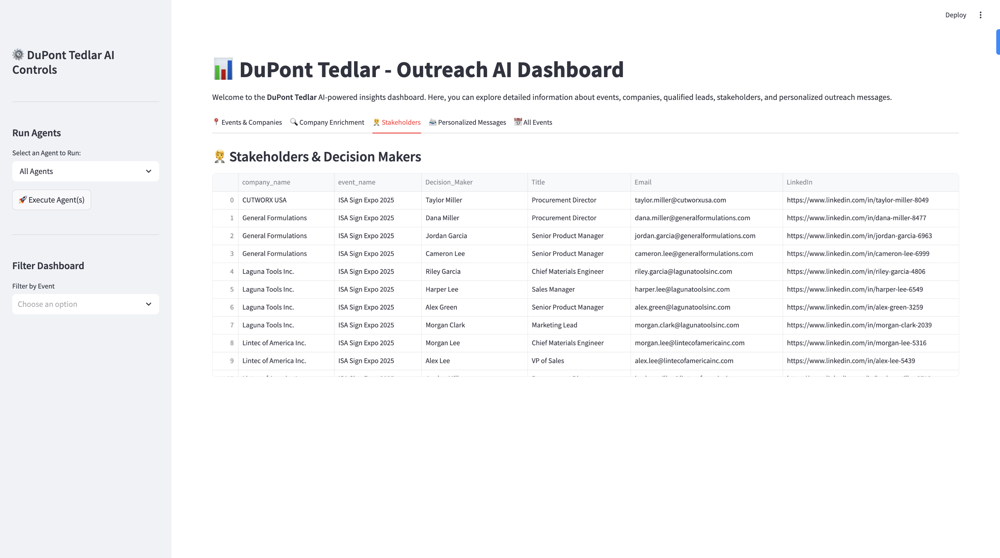

# 🚀 DuPont Tedlar AI Agentic Workflow

This project implements an end-to-end **AI agent workflow** to discover, evaluate, and prioritize B2B opportunities in the signage and graphics industry for DuPont Tedlar’s protective film solutions. The workflow automates event scouting, company enrichment, stakeholder identification, outreach message generation, and lead scoring — all integrated into a Streamlit dashboard.

---

## 📦 Setup Instructions

### 1. Clone the Repo

```bash
git clone https://github.com/HarshitSingh27/Instalily-Harshit
```

### 2. Create a Virtual Environment

#### On macOS/Linux:

```bash
python3 -m venv .venv
source .venv/bin/activate
```

#### On Windows:

```bash
python -m venv .venv
.venv\Scripts\activate
```
#### .env file template
```
OPENAI_API_KEY=your_openai_key
PERPLEXITY_API_KEY=your_perplexity_key
```
---

## 📥 Install or Upgrade Requirements

Preferred (recommended to get latest versions):

```bash
pip install --upgrade -r requirements.txt
```

Or (basic install):

```bash
pip install -r requirements.txt
```

---

## ⚙️ Run the Agent Workflow

### 🔁 Option 1: Run Everything from the Dashboard 

Simply launch the dashboard to access and execute all agents from an interactive UI:

```bash
streamlit run dashboard.py
```
The dashboard includes built-in buttons to:

Run any individual agent or the full pipeline

View discovered events, enriched companies, stakeholders, outreach messages, and scored leads
### 🔁 Option 2: Run from the Terminal
# Run all agents sequentially
python main.py

# Run a specific agent only
python main.py --agent enrich

Available agent keys:

scout → event_scout_agent.py

hunter → company_hunter_agent.py

enrich → company_enrichment_agent.py

stakeholder → stakeholderfinder_agent.py

message → message_agent.py

scoring → lead_scoring_agent.py
## 🖼️ Dashboard Screenshots







---

## 🤖 Summary

The Agentic system uses:
- 🔍 Perplexity + GPT for event/company analysis
- 🧠 GPT-4 and 3.5 for message & lead scoring
- 🎯 Dummy LinkedIn + Hunter for stakeholders (can be upgraded to real APIs)
- 📈 Output: `qualified_leads_scored.csv` — sorted, enriched, and ready to act on.
